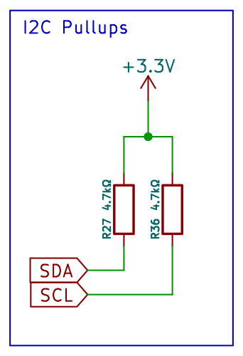

<!-- AUTO-GENERATED — do not edit, this file is overwritten on every push to main -->

# I2C_Pullups

 

I2C pull-up resistors 4.7k 0603 for 3.3V bus, one pair per block

## Bill of Materials

*Manufacturer and MPN fetched automatically from [LCSC](https://lcsc.com).*

| Refs | Value | Footprint | LCSC | JLCPCB | Manufacturer | MPN | Category |
| --- | --- | --- | --- | --- | --- | --- | --- |
| R27, R36 | 4.7kΩ | R_0603_1608Metric | C99782 | Extended | YAGEO | RC0603FR-074K7L | Resistors |

---
*Keywords: i2c pullup 4k7 0603 3V3*

| | |
|---|---|
| Maturity | Schematic |
| LCSC Parts | Yes |
| JLCPCB | Optimized for Basic Parts |
| 3D Models | No |
| Reviewed | No |
