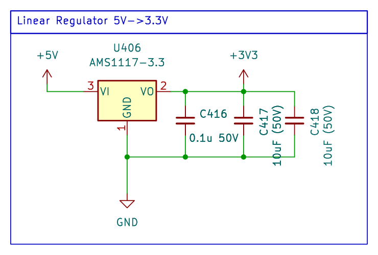

<!-- AUTO-GENERATED — do not edit, this file is overwritten on every push to main -->

# LinearRegulator_AMS1117

LDO linear regulator, Vin 5V, Vout 3.3V fixed, 1A max, AMS1117-3.3 (SOT-223)

## Bill of Materials

*Manufacturer and MPN fetched automatically from [LCSC](https://lcsc.com).*

| Refs | Value | Footprint | LCSC | JLCPCB | Manufacturer | MPN | Category |
| --- | --- | --- | --- | --- | --- | --- | --- |
| C416 | 0.1u 50V | C_0603_1608Metric | C14663 | Basic | YAGEO | CC0603KRX7R9BB104 | Multilayer Ceramic Capacitors MLCC - SMD/SMT |
| C417, C418 | 10uF (50V) | C_1206_3216Metric | C13585 | Basic | SAMSUNG | CL31A106KBHNNNE | Multilayer Ceramic Capacitors MLCC - SMD/SMT |
| U406 | AMS1117-3.3 | SOT-223-3_TabPin2 | C6186 | Basic | Advanced Monolithic Systems | AMS1117-3.3 | Linear Voltage Regulators (LDO) |

---
*Keywords: ldo linear regulator 3V3 AMS1117*

| | |
|---|---|
| Maturity | Schematic |
| LCSC Parts | Yes |
| JLCPCB Basic | Yes |
| 3D Models | No |
| Reviewed | No |
