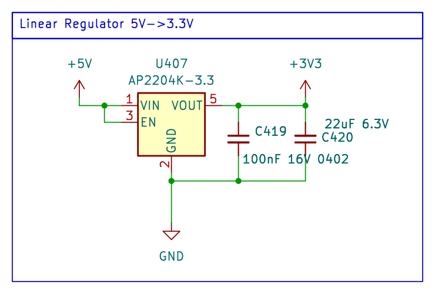

<!-- AUTO-GENERATED — do not edit, this file is overwritten on every push to main -->

# LinearRegulator_AP2204K

 

LDO linear regulator with enable pin, Vin 5V, Vout 3.3V fixed, 150mA max, AP2204K (SOT-23-5)

## Bill of Materials

*Manufacturer and MPN fetched automatically from [LCSC](https://lcsc.com).*

| Refs | Value | Footprint | LCSC | JLCPCB | Manufacturer | MPN | Category |
| --- | --- | --- | --- | --- | --- | --- | --- |
| C419 | 100nF 16V 0402 | C_0402_1005Metric | C1525 | Basic | SAMSUNG | CL05B104KO5NNNC | Multilayer Ceramic Capacitors MLCC - SMD/SMT |
| C420 | 22uF 6.3V | C_0402_1005Metric | C105226 | Extended | SAMSUNG | CL05A226MQ5QUNC | Multilayer Ceramic Capacitors MLCC - SMD/SMT |
| U407 | AP2204K-3.3 | SOT-23-5 | C112032 | Extended | DIODES | AP2204K-3.3TRG1 | Linear Voltage Regulators (LDO) |

---
*Keywords: ldo linear regulator 3V3 AP2204K*

| | |
|---|---|
| Maturity | Schematic |
| LCSC Parts | Yes |
| JLCPCB | Optimized for Basic Parts |
| 3D Models | No |
| Reviewed | No |
