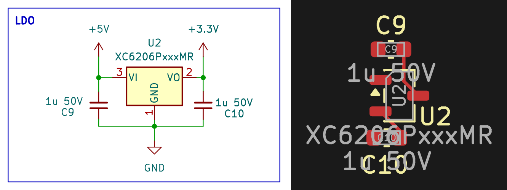

<!-- AUTO-GENERATED — do not edit, this file is overwritten on every push to main -->

# LinearRegulator_XC6206P

 

LDO linear regulator, Vin 5V, Vout 3.3V fixed, 250mA max, XC6206P (SOT-23-3)

## Bill of Materials

*Manufacturer and MPN fetched automatically from [LCSC](https://lcsc.com).*

| Refs | Value | Footprint | LCSC | JLCPCB | Manufacturer | MPN | Category |
| --- | --- | --- | --- | --- | --- | --- | --- |
| C9, C10 | 1u 50V | C_0603_1608Metric | C15849 | Basic | SAMSUNG | CL10A105KB8NNNC | Multilayer Ceramic Capacitors MLCC - SMD/SMT |
| U2 | XC6206PxxxMR | SOT-23-3 | C5446 | Basic | TOREX | XC6206P332MR-G | Linear Voltage Regulators (LDO) |

---
*Keywords: ldo linear regulator 3V3 XC6206*

| | |
|---|---|
| Maturity | Layout |
| LCSC Parts | Yes |
| JLCPCB | Optimized for Basic Parts |
| 3D Models | Yes |
| Reviewed | No |
