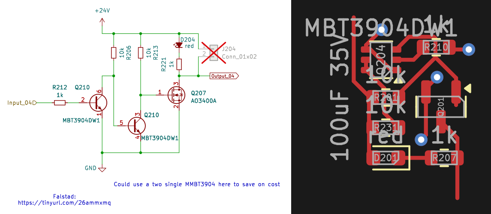

<!-- AUTO-GENERATED — do not edit, this file is overwritten on every push to main -->

# Mosfet_Pair_24VfromMCU

Low-side switch for 24V loads, BJT-driven N-ch MOSFET (AO3400A), active high, MCU-compatible input, status LED included

## Bill of Materials

*Manufacturer and MPN fetched automatically from [LCSC](https://lcsc.com).*

| Refs | Value | Footprint | LCSC | JLCPCB | Manufacturer | MPN | Category |
| --- | --- | --- | --- | --- | --- | --- | --- |
| D204 | red | LED_0603_1608Metric | C2286 | Basic | KENTO | KT-0603R | Light Emitting Diodes (LED) |
| Q207 | AO3400A | SOT-23 | C20917 | Basic | AOS | AO3400A | MOSFETs |
| Q210, Q210 | MBT3904DW1 | SOT-363_SC-70-6 | C110150 | Extended | onsemi | MBT3904DW1T1G | Bipolar Transistors - BJT |
| R206, R213 | 10k | R_0603_1608Metric | C25804 | Basic | UNI-ROYAL | 0603WAF1002T5E | Resistors |
| R212, R221 | 1k | R_0603_1608Metric | C21190 | Basic | UNI-ROYAL | 0603WAF1001T5E | Resistors |

---
*Keywords: mosfet mcu low-side switching*

| | |
|---|---|
| Maturity | Layout |
| LCSC Parts | Yes |
| JLCPCB Basic | Yes |
| 3D Models | Yes |
| Reviewed | No |
