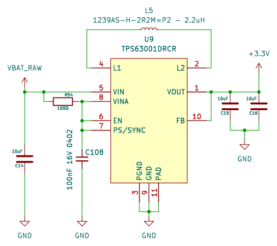

<!-- AUTO-GENERATED — do not edit, this file is overwritten on every push to main -->

# StepUpDown_TPS63001_3V3

 

Buck-boost 3.3V from single Li-Ion (2.5-5.5V in), TPS63001DRCR VSON-10, 2.2uH, 3x10uF

## Bill of Materials

*Manufacturer and MPN fetched automatically from [LCSC](https://lcsc.com).*

| Refs | Value | Footprint | LCSC | JLCPCB | Manufacturer | MPN | Category |
| --- | --- | --- | --- | --- | --- | --- | --- |
| C14, C15, C16 | 10uF | C_0603_1608Metric | C92487 | Extended | SAMSUNG | CL10A106MO8NQNC | Multilayer Ceramic Capacitors MLCC - SMD/SMT |
| C108 | 100nF 16V 0402 | C_0603_1608Metric | C14663 | Basic | YAGEO | CC0603KRX7R9BB104 | Multilayer Ceramic Capacitors MLCC - SMD/SMT |
| L5 | 1239AS-H-2R2M=P2 - 2.2uH | L_1008_2520Metric | C237285 | Extended | muRata | 1239AS-H-2R2M=P2 | Power Inductors |
| R54 | 100Ω | R_0603_1608Metric | C22775 | Basic | UNI-ROYAL | 0603WAF1000T5E | Resistors |

---
*Keywords: buck boost 3V3 tps63001 lipo battery vson*

| | |
|---|---|
| Maturity | Schematic |
| LCSC Parts | Yes |
| JLCPCB | No |
| 3D Models | No |
| Reviewed | No |
