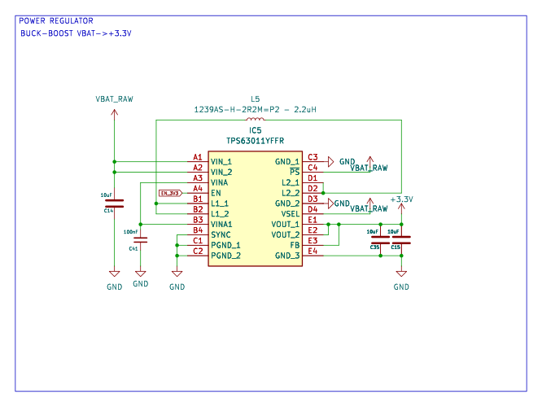

<!-- AUTO-GENERATED — do not edit, this file is overwritten on every push to main -->

# StepUpDown_TPS63011YFFR_3V3

 

Buck-boost 3.3V from single Li-Ion, TPS63011YFFR DSBGA-20 2A switches, 2.2uH, 3x10uF

## Bill of Materials

*Manufacturer and MPN fetched automatically from [LCSC](https://lcsc.com).*

| Refs | Value | Footprint | LCSC | JLCPCB | Manufacturer | MPN | Category |
| --- | --- | --- | --- | --- | --- | --- | --- |
| C14, C15, C35 | 10uF | C_0603_1608Metric | C92487 | Extended | SAMSUNG | CL10A106MO8NQNC | Multilayer Ceramic Capacitors MLCC - SMD/SMT |
| C41 | 100nF | C_0603_1608Metric | C108079 | Extended | YAGEO | CC0603KRX7R7BB104 | Multilayer Ceramic Capacitors MLCC - SMD/SMT |
| IC5 | TPS63011YFFR | BGA20C40P4X5_192X213X62 | C2071276 | Extended | TI | TPS63011YFFR | DC-DC Converters |
| L5 | 1239AS-H-2R2M=P2 - 2.2uH | L_1008_2520Metric | C237285 | Extended | muRata | 1239AS-H-2R2M=P2 | Power Inductors |

---
*Keywords: buck boost 3V3 tps63011 lipo battery dsbga*

| | |
|---|---|
| Maturity | Schematic |
| LCSC Parts | Yes |
| JLCPCB | No |
| 3D Models | No |
| Reviewed | No |
