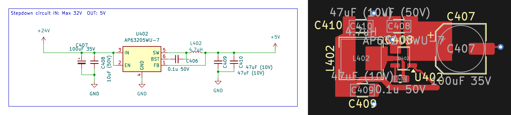

# Stepdown_24VIn_5VOut

Buck (step-down) DC/DC converter, Vin max 32V, Vout fixed 5V

## Bill of Materials

| Refs | Value | Footprint | LCSC |
| --- | --- | --- | --- |
| C406 | 0.1u 50V | C_0603_1608Metric | C14663 |
| C407 | 100uF 35V | CP_Elec_6.3x5.4 | C2836442 |
| C408 | 10uF (50V) | C_1206_3216Metric | C13585 |
| C409, C410 | 47uF (10V) | C_1206_3216Metric_Pad1.33x1.80mm_HandSolder | C96123 |
| L402 | 4.7uH | L_Sunlord_MWSA0503S | C177246 |
| U402 | AP63205WU-7 | TSOT-23-6 | C2071056 |

---
**Keywords:** buck step-down dcdc converter 5V power · **Maturity:** layout · **LCSC parts:** yes · **JLCPCB Basic:** yes · **3D models:** yes · **Reviewed:** no
