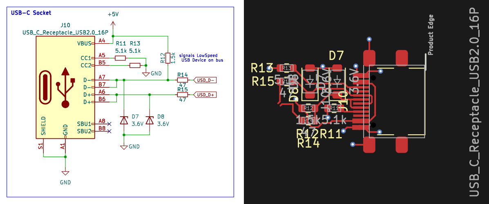

<!-- AUTO-GENERATED — do not edit, this file is overwritten on every push to main -->

# USB-C_Socket_HID

 

USB 2.0 Type-C receptacle, low-speed HID device, CC resistors for 5V power negotiation, ESD protection on D+/D-

## Bill of Materials

*Manufacturer and MPN fetched automatically from [LCSC](https://lcsc.com).*

| Refs | Value | Footprint | LCSC | JLCPCB | Manufacturer | MPN | Category |
| --- | --- | --- | --- | --- | --- | --- | --- |
| D7, D8 | 3.6V | D_SOD-123 | C22395524 | Extended | R+O | MM1W3V6 | Zener Diodes |
| J10 | USB_C_Receptacle_USB2.0_16P | USB_C_SMD_allpin_Aliexpress | C2681552 | Extended | SHOU HAN | TYPE-C 16P QTGM027 | USB Connectors |
| R11, R13 | 5.1k | R_0603_1608Metric | C23186 | Basic | UNI-ROYAL | 0603WAF5101T5E | Resistors |
| R12 | 1.5k | R_0603_1608Metric | C22843 | Basic | UNI-ROYAL | 0603WAF1501T5E | Resistors |
| R14, R15 | 47 | R_0603_1608Metric | C23182 | Basic | UNI-ROYAL | 0603WAF470JT5E | Resistors |

---
*Keywords: usb usb-c connector hid tinyusb*

| | |
|---|---|
| Maturity | Layout |
| LCSC Parts | Yes |
| JLCPCB | Optimized for Basic Parts |
| 3D Models | Yes |
| Reviewed | No |
